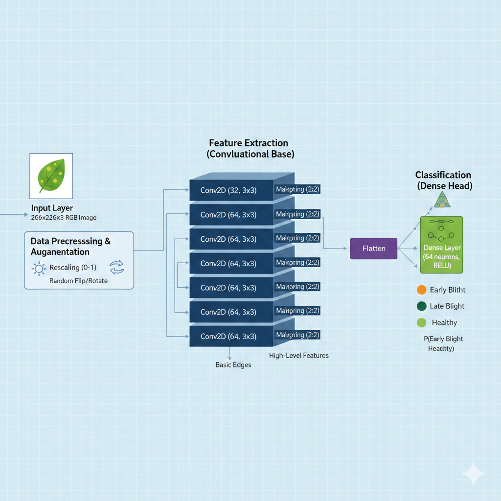

# Potato Disease Detection System

An AI-powered application designed to detect and classify diseases in potato plants using Deep Learning and Convolutional Neural Networks (CNN).

## Project Overview
This project provides an end-to-end solution for automated potato leaf disease diagnosis. It features a high-performance Keras model integrated into a user-friendly Streamlit web interface, allowing users to upload photos or use a live camera feed for instant classification.

## Model Features
The core of this system is a Convolutional Neural Network (CNN) trained on thousands of plant images.

- **Architecture**: Sequential model with layers of Conv2D for feature extraction and MaxPooling2D for downsampling.
- **Input Dimensions**: 256x256 pixels (RGB).
- **Output Classes**:
  - `Potato___Early_blight`
  - `Potato___Late_blight`
  - `Potato___healthy`
- **Normalization**: Built-in resizing and rescaling [0, 1] preprocessing.
- **Performance**: Capable of high-confidence predictions on diverse leaf backgrounds.

## System Architecture

## Usability and Potentiality
### Usability
- **Simplicity**: No technical knowledge required; simple "click and predict" workflow.
- **Accessibility**: Runs in any modern web browser via Streamlit.
- **Accessibility**: Dual-input support (File Upload or Real-time Camera).

### Potentiality
- **Agricultural Impact**: Helps farmers identify problems early, reducing the need for broad-spectrum pesticides and preserving crop yield.
- **Scalability**: The underlying architecture can be fine-tuned to detect diseases in other vegetables (Tomato, Bell Pepper, etc.).
- **Data-Driven Farming**: Can be used as a data collection point to track disease outbreaks geographically.

## Future Works
- **Treatment Recommendations**: Integrated logic to suggest specific fungicides or organic treatments based on the detected disease.
- **Multi-Crop Expansion**: Extending the model to support 10+ plant species and 50+ disease categories.
- **Offline Deployment**: Compiling the model to TensorFlow Lite for use in offline edge devices.
- **IoT Integration**: Connecting with smart-farm sensors to trigger alerts when environmental conditions favor disease growth (e.g., high humidity).

---
*Developed with TensorFlow, NumPy, and Streamlit.*
